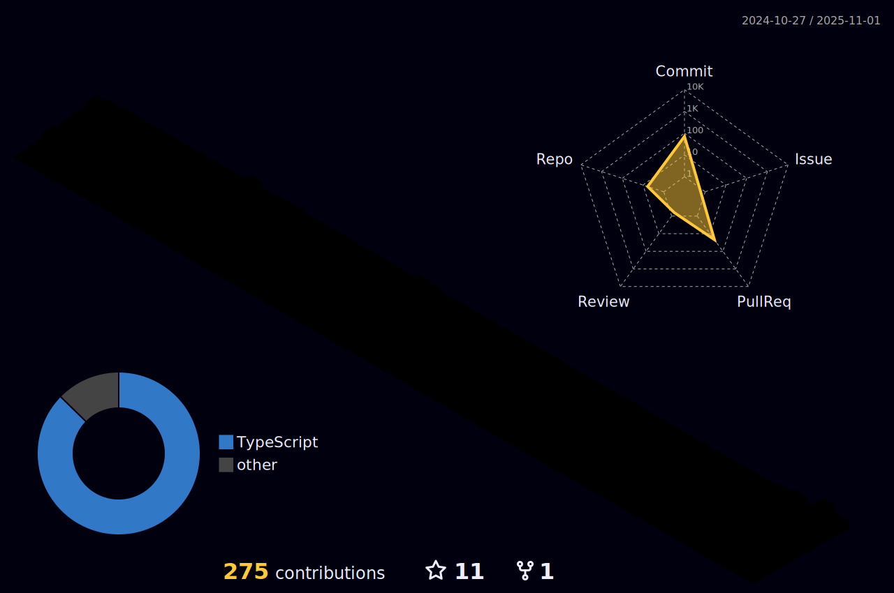

  
<!--  -->
  
<!--    -->

<!-- 
**TanatornZ/TanatornZ** is a ✨ _special_ ✨ repository because its `README.md` (this file) appears on your GitHub profile.

Here are some ideas to get you started: -->

<!-- - 🔭 I’m currently working on ... -->
 

# Hi I'm Tanatorn Intaphong 

- 🌱 I’m currently learning front-end developer and flutter 
- 🔭 I’m currently studying in Software Engineering at University of Phayao.
- ⚡ Fun fact: I like to play guitar
<!-- - 🌱 I’m currently learning ... 
- 👯 I’m looking to collaborate on ...
- 🤔 I’m looking for help with ...
- 💬 Ask me about ...
- 📫 How to reach me: ...
- 😄 Pronouns: ...
- ⚡ Fun fact: ... -->

